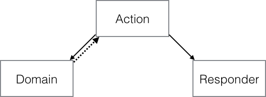
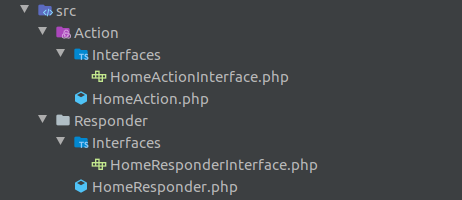

# Qu’est ce que l’ADR (Action Domain Responder) ?
Pour commencer, voici la définition que l’on peut trouver sur Wikipédia :
> “C’est un modèle d’architecture logicielle proposé par Paul M. Jones afin d’affiner le contrôleur Model View Controller (MVC), mieux adapté aux applications Web. ADR a été conçu pour correspondre plus étroitement au flux demande-réponse des communications HTTP à MVC, conçu à l’origine pour les applications logicielles de bureau. Semblable à MVC, le motif est divisé en trois parties.”

Responsabilité de chacune des parties.
## ACTION
L’action est la partie qui va traiter les requêtes HTTP. C’est le connecteur entre le code métier (domain) et le responder. Il va utiliser les requêtes HTTP pour interagir avec le domaine puis appelle le responder avec les données du domaine pour la création d’une réponse en HTTP.
## DOMAIN
Le domaine est la partie qui va interagir directement avec la base de données (manipulation des données selon les besoins). C’est le cœur de l’application il contient la logique métier.
## RESPONDER
Le responder est la partie qui construit la réponse HTTP peu importe son format (HTML,json,xml..). Il va traiter les données reçues de l’action pour en générer une vue.
### Ses avantages et ses inconvénients
#### Les avantages :
* L’ADR applique le principe de “Single responsibility principle” de SOLID qui veut qu’un composant n’ait qu’une seule responsabilité. Cela permet de simplifier les tests.
* Il évite la duplication de code.
* Mais son avantage principal, c’est qu’il rend très simple la lecture (et revue) du code.
Comme toute chose, cette architecture a aussi des inconvénients. Principalement un.Chaque classe ayant une responsabilité, il est nécessaire de créer plus de classes, donc plus de fichiers dans votre code source. Pour certains, le code paraîtra donc plus complexe, et donc moins maintenable.
Il est donc nécessaire de bien comprendre pourquoi l’utiliser.

### POURQUOI UTILISER DE L’ADR ?
Dans le modèle MVC, il y a un contrôleur qui traite la logique, les formulaires, les événements, etc… Il renvoie la réponse, ce qui n’est pas forcément une bonne pratique.
En effet, on se retrouve avec des contrôleurs surchargés qui sont plus difficiles à tester et plus lents lors de l’exécution. Cela convient la plupart du temps, mais dans le cas de ADR le responder a une responsabilité : c’est de renvoyer une réponse adapter au besoin.
La logique n’est plus la même, car l’application est découpée besoin par besoin. L’action qui effectue la logique interne et le responder qui renvoie la vue. Cette division va nous simplifier les tests et la revue du code.

### MISE EN PLACE DE L’ADR DANS SYMFONY 4

La première étape consiste à mettre en place notre propre architecture de dossier pour suivre le pattern ADR :

Dans le dossier src de notre projet, nous allons renommer le dossier Controller par Action.
Puis créer un dossier (toujours dans le src) au nom de Responder. Pour le moment rien de compliqué.
À l’intérieur nous allons créer une première interface au nom de HomeResponderInterface qui comporte la méthode render().

Dans le dossier Responder, nous allons créer une classe au nom de HomeResponder qui va implémenter l’interface HomeResponderInterface avec la fonction render() qui va prendre en paramètre le nom de la vue et qui va pouvoir nous retourner la vue twig correspondante.

Ensuite nous allons procéder aux mêmes étapes que dans le dossier Responder, mais cette fois-ci dans le dossier Action, à l’intérieur une interface au nom de HomeActionInterface sans méthode.

Et on créé une classe HomeAction dans le dossier Action qui va implémenter l’interface HomeActionInterface et qui va juste avoir comme action de retourner la vue twig du Responder.

Faisons un petit point : à ce stade, nous avons à présent notre responder qui va créer la vue et notre action qui va retourner directement la vue du Responder via une réponse HTTP.

Passons à la configuration du fichier services.yaml qui se trouve dans le dossier de config.
On ne veut plus que ce soit le controller qui traite la requête mais l’action. Pour ça, changerons les chemins suivants : 
App\Controller\ : par App\Action\ : et resource : ‘../src/Controller’ par resource : ‘../src/Action’

Et si vous utilisez les annotations pour les routes dans Symfony 4, il vous suffit de changer le fichier annotations.yaml dans le dossier config > routes. Pour que la prise des routes en annotation soit prise dans votre dossier action.

## POUR CONCLURE
Nous avons à présent quelque chose de fonctionnel.
Grâce à cet exemple, nous pouvons nous rendre compte qu’en utilisant l’ADR, le code est plus simple à lire, et donc, plus facile à maintenir et à faire évoluer.
Les tests sont aussi écrits plus vite (on écrit le test, la classe et ensuite on vérifie que ça fonctionne).
Et cela évite d’avoir un controller contenant plusieurs méthodes (plus lent à exécuter et plus difficile à tester).
Pour un exemple concret, le projet api-platform open source intègre déjà le pattern ADR:
https://api-platform.com/docs/core/controllers/

Et le framework Phalcon l'integre aussi .

### Présentation video de Kévin Dunglas
_______________________________________

[Source article](https://medium.com/darkmirafr/symfony-4-un-framework-uniquement-mvc-eeb6e375fda6)